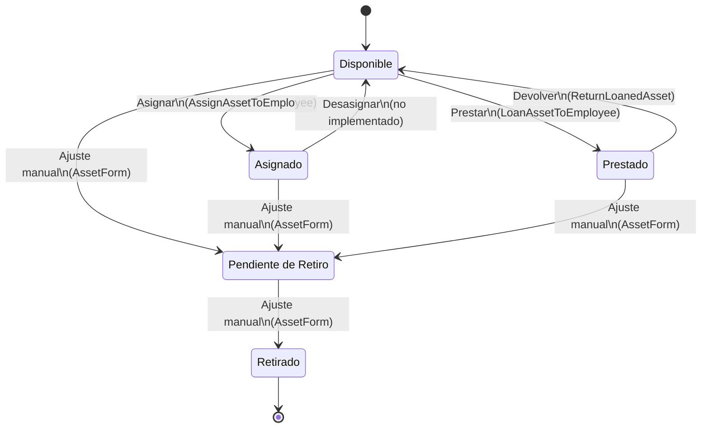

# Estados de Activos (Asset) — State Machine (MVP)

Fuente de verdad:

- Estados: `gatic/app/Models/Asset.php` (`Asset::STATUSES`, `Asset::UNAVAILABLE_STATUSES`)
- Reglas de transición (operaciones): `gatic/app/Support/Assets/AssetStatusTransitions.php`
- Cambios de estado “por operación” (movimientos):
  - `gatic/app/Actions/Movements/Assets/AssignAssetToEmployee.php`
  - `gatic/app/Actions/Movements/Assets/LoanAssetToEmployee.php`
  - `gatic/app/Actions/Movements/Assets/ReturnLoanedAsset.php`

## Estados (qué significan)

| Estado | Semántica | Impacto en “disponible” |
|---|---|---|
| `Disponible` | No está asignado/prestado y puede operar | Cuenta como disponible |
| `Asignado` | En tenencia de un empleado (no préstamo) | No disponible |
| `Prestado` | En préstamo a un empleado | No disponible |
| `Pendiente de Retiro` | No debe volver a circular (bloquea operaciones) | No disponible |
| `Retirado` | Fuera de circulación | Se excluye de totales operativos |

Notas:

- “No disponible” en inventario serializado se define por `Asset::UNAVAILABLE_STATUSES` (`Asignado`, `Prestado`, `Pendiente de Retiro`).
- `Retirado` se trata aparte: se muestra en desglose, pero se excluye de totales operativos (ver `ProductShow`/`ProductsIndex`).

## Diagrama (MVP)

## Reglas de transición (server-side)

Las operaciones (movimientos) validan transición con `AssetStatusTransitions::assertCan*()`:

- `Asignar`:
  - Solo desde `Disponible`
  - Bloqueado si: `Prestado`, `Asignado`, `Pendiente de Retiro`, `Retirado`
- `Prestar`:
  - Solo desde `Disponible`
  - Bloqueado si: `Asignado`, `Prestado`, `Pendiente de Retiro`, `Retirado`
- `Devolver`:
  - Solo desde `Prestado`
  - Bloqueado si: `Retirado`

## Nota importante: “ajustes manuales” vs. movimientos

`gatic/app/Livewire/Inventory/Assets/AssetForm.php` permite editar `status` directamente (por permisos de inventario).

Eso es útil para mantenimiento, pero **no aplica invariantes de movimientos** (p. ej., `current_employee_id`) y puede dejar combinaciones inconsistentes si se usa sin cuidado.

