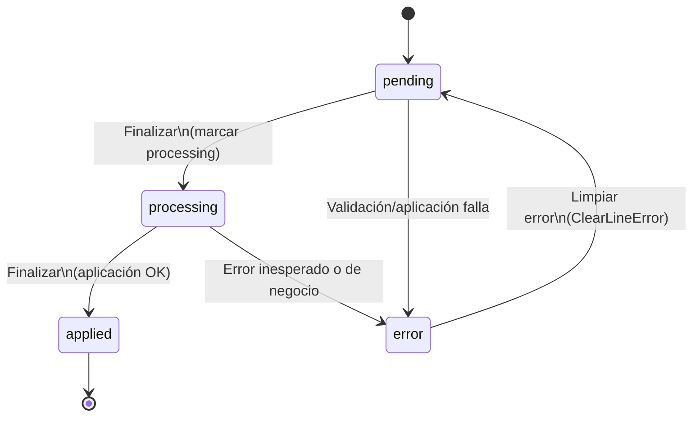

# Estados de Renglones (PendingTaskLine) — State Machine (MVP)

Fuente de verdad:

- Estados: `gatic/app/Enums/PendingTaskLineStatus.php`
- Transiciones:
  - Finalización por renglón: `gatic/app/Actions/PendingTasks/FinalizePendingTask.php`
  - Limpiar error: `gatic/app/Actions/PendingTasks/ClearLineError.php`

## Estados

| Valor (`PendingTaskLineStatus`) | Label UI | Intención |
|---|---|---|
| `pending` | Pendiente | Listo para validarse/aplicarse |
| `processing` | Procesando | En aplicación (por finalización) |
| `applied` | Aplicado | Ya aplicado (idempotente: no se reaplica) |
| `error` | Error | Falló (mensaje en `error_message`) |

## Diagrama (MVP)

## Notas operativas

- `FinalizePendingTask` usa transacción y `lockForUpdate()` por renglón para evitar doble-aplicación concurrente.
- Si ocurre un error inesperado, el mensaje al usuario incluye un `error_id` (prefijo `ERR-`) para soporte.

