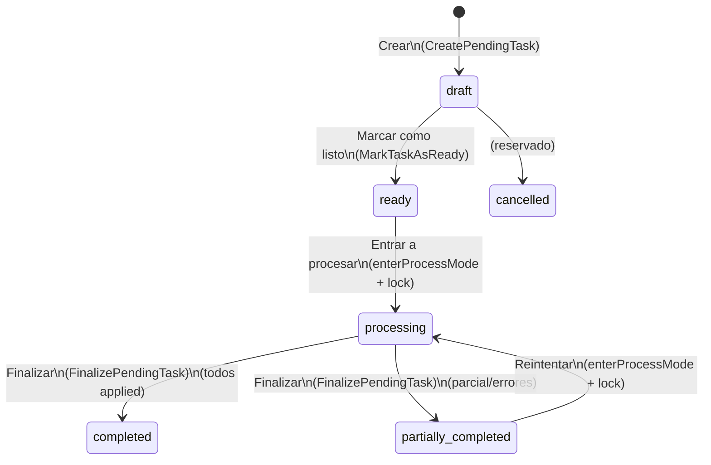

# Estados de Tareas Pendientes (PendingTask) — State Machine (MVP)

Fuente de verdad:

- Estados: `gatic/app/Enums/PendingTaskStatus.php`
- Modelo y helpers (locks): `gatic/app/Models/PendingTask.php`
- Transiciones principales:
  - Crear: `gatic/app/Actions/PendingTasks/CreatePendingTask.php`
  - Marcar listo: `gatic/app/Actions/PendingTasks/MarkTaskAsReady.php`
  - Procesar/Finalizar: `gatic/app/Livewire/PendingTasks/PendingTaskShow.php`, `gatic/app/Actions/PendingTasks/FinalizePendingTask.php`

## Estados

| Valor (`PendingTaskStatus`) | Label UI | Intención |
|---|---|---|
| `draft` | Borrador | Se agregan/editan renglones |
| `ready` | Listo | Preparada para procesarse (con lock) |
| `processing` | Procesando | En proceso (con lock) |
| `completed` | Finalizado | Todos los renglones quedaron `applied` |
| `partially_completed` | Parcialmente finalizado | Hay mezcla de `applied` + `error` (o parcial) |
| `cancelled` | Cancelado | Reservado (no usado en flujo actual) |

Regla clave: edición de renglones solo en `draft` (ver `PendingTaskStatus::allowsLineEditing()`).

## Diagrama (MVP)

## Notas operativas

- El lock es un mecanismo aparte (ver `gatic/docs/patterns/concurrency-locks.md`), pero en UI:
  - “Entrar a procesar” intenta adquirir lock y, si estaba en `ready`, mueve a `processing`.
  - “Finalizar” exige lock activo y al terminar intenta liberar el lock.

